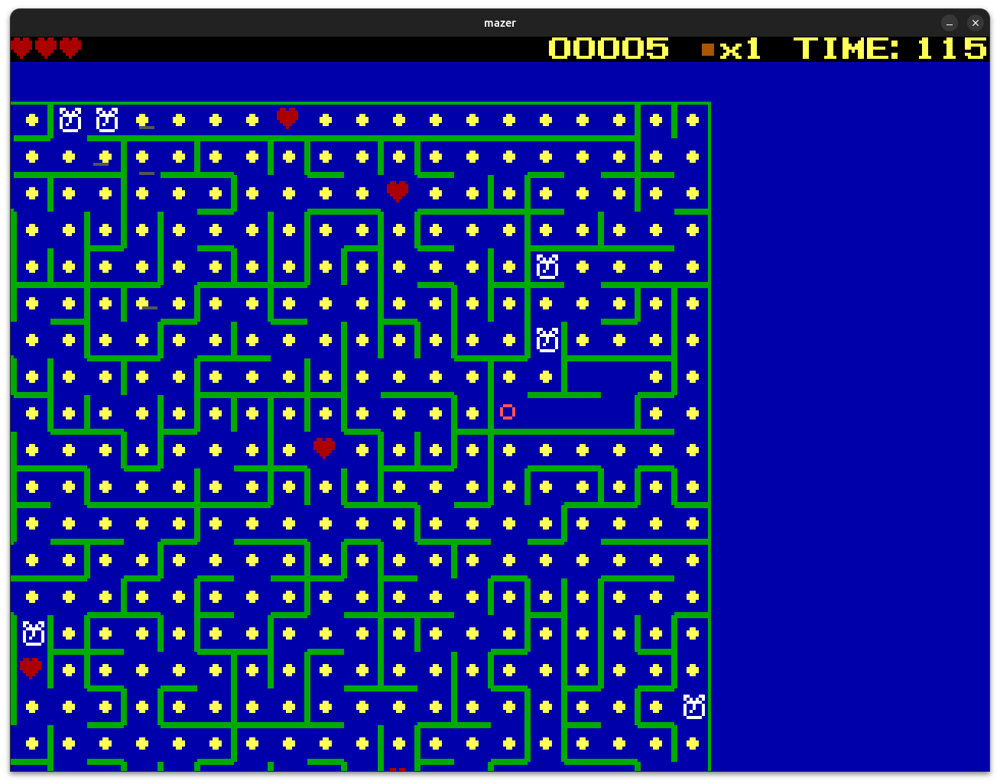

# mazer

A retro maze game with CGA-style graphics built with SDL2. Navigate a procedurally generated 36×36 maze from **S** to **F** before your time runs out, collecting items and dodging whirligigs along the way.

[](https://github.com/treytomes/mazer/actions/workflows/ci.yml)
[](https://ko-fi.com/treytomes)



## Building

**Dependencies:** SDL2 (`sudo apt install libsdl2-dev` on Ubuntu/Debian)

```sh
cmake -B build
cmake --build build
./build/mazer
```

## How to Play

You start at the green flashing **S** marker and must reach the red flashing **F**. The game ends when you run out of time, run out of hearts, or reach the finish.

### Controls

| Keyboard | Gamepad | Action |
|----------|---------|--------|
| Arrow keys | D-pad / Left stick | Move / navigate menus |
| Shift + Arrow | Right shoulder + D-pad | Place a block in that direction |
| Tab | Start | Pause / unpause |
| `` ` `` (hold) | Right shoulder (hold) | Show the solution path |
| Enter | A | Confirm / select |
| Escape | B | Back / quit |
| Alt + Enter | — | Toggle fullscreen |

### HUD

The top bar shows — left to right — your hearts, score, block count, and time remaining. Time turns red when under 10 seconds.

### Items

| Item | Effect |
|------|--------|
| · (pellet) | +1 point |
| Clock | +10 seconds, +10 points |
| ♥ (heart) | +1 heart, +20 points |

### Whirligigs

Whirligigs are spinning enemies that wander the maze. Colliding with one costs a heart, shakes the screen, and spawns a new whirligig elsewhere. Up to 16 roam the maze at once.

### Blocks

You can place one block at a time by holding Shift and pressing an arrow key. The block appears in the adjacent cell in that direction. Blocks stop both whirligigs and the player, and last 10 seconds — visually fading from █ to ▓ to ▒ to ░ as they decay. Your block slot is returned once it expires.

## Scoring

The end screen tallies your final score:

- Each remaining heart × 20
- Each remaining second × 2
- Pellets and items collected × 1 each
- Finishing the maze: +1000 bonus

After scoring you are asked to play again (Y/N). Completing a maze advances to the next seed — mazes are deterministic, so the same seed always produces the same maze.
